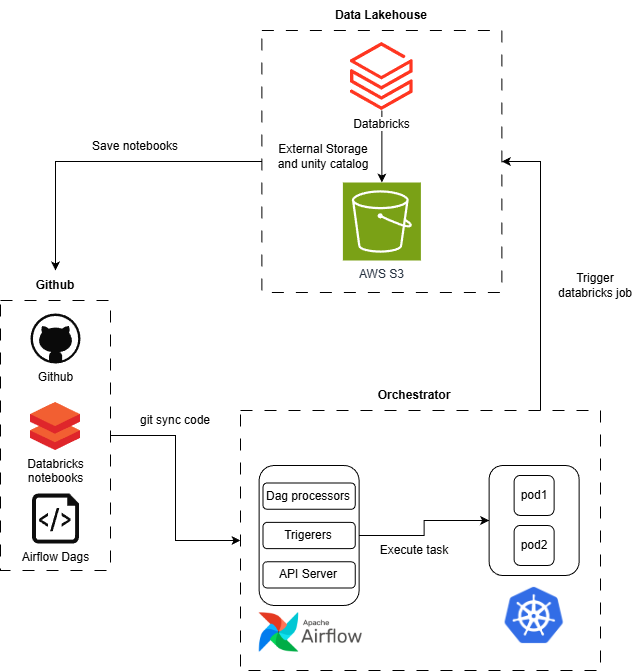

# Databricks and Airflow - StackExchange Data

A data platform implementation using Databricks for data transformation and Airflow 3.0 on Kubernetes for orchestration, deployed on a local Kind cluster. This project processes StackExchange public data dump using a medallion architecture (Bronze, Silver, Gold).

Data source: [StackExchange Data Dump](https://meta.stackexchange.com/questions/2677/database-schema-documentation-for-the-public-data-dump-and-sede)

## Features

- Data-aware orchestration using Airflow 3.0 Assets
- Declarative transformation using Databricks notebooks
- Incremental upsert loading with Delta Lake
- Local Kubernetes cluster on Kind
- Data quality checks on bronze layer
- Git-sync sidecar for DAG synchronization
- Medallion architecture (Bronze, Silver, Gold layers)
- Automated data ingestion from StackExchange archive

## Architecture
<div align="center">



</div>

- **Bronze Layer**: Raw data ingestion from StackExchange XML files (Posts, Users)
- **Silver Layer**: Data cleansing and transformation
- **Gold Layer**: Business-level aggregations (popular tags, posts-users analytics)

Orchestration is handled by Airflow DAGs that:
1. Download and extract StackExchange data from archive.org
2. Upload raw XML files to S3
3. Trigger Databricks workflows for transformation

## Installation

### Prerequisites

- Docker
- kubectl
- helm
- kind

### Setup Kind Cluster

```bash
./install_airflow.sh
```

This script will:
- Create a Kind cluster
- Build and load the Airflow Docker image
- Install Airflow using Helm
- Configure git-sync for DAG synchronization

### Configuration

Set up the following secrets before installation:

**Git Sync Credentials**

Generate base64 encoded credentials:
```bash
echo -n 'your_github_username' | base64
echo -n 'your_github_token' | base64
```

Create `k8s/secrets/git-secrets.yaml`:
```yaml
apiVersion: v1
kind: Secret
metadata:
  name: git-credentials
  namespace: airflow
data:
  GITSYNC_USERNAME: <base64 encoded username>
  GITSYNC_PASSWORD: <base64 encoded token>
  GIT_SYNC_USERNAME: <base64 encoded username>
  GIT_SYNC_PASSWORD: <base64 encoded token>
```

**Airflow Connections**

Configure the following connections in Airflow UI:
- `aws_conn`: AWS credentials for S3 access
- `databricks_conn`: Databricks workspace URL and access token

## Project Structure

```
.
├── dags/                           # Airflow DAG definitions
│   ├── produce_data.py            # Data ingestion DAG with Assets
│   └── trigger_databricks_workflow.py  # Databricks job trigger
├── notebooks/                      # Databricks notebooks
│   ├── bronze_posts.ipynb         # Posts ingestion
│   ├── bronze_users.ipynb         # Users ingestion
│   ├── bronze_posts_dataquality.ipynb  # Data quality checks
│   ├── silver_posts.ipynb         # Posts transformation
│   ├── gold_posts_users.ipynb     # Posts-users analytics
│   └── gold_most_popular_tags.ipynb    # Tag analytics
├── source/                         # Source data files
│   ├── Posts.xml
│   ├── Users.xml
│   └── StackExchange Overview.lvdash.json
├── chart/                          # Helm chart values
│   └── values-override.yaml
├── cicd/                          # CI/CD configuration
│   └── Dockerfile
├── k8s/                           # Kubernetes manifests
│   └── secrets/
├── install_airflow.sh             # Installation script
└── requirements.txt               # Python dependencies
```

## DAGs

### produce_data_assets
Downloads StackExchange data from archive.org, extracts XML files, and uploads to S3. Produces two data assets:
- `s3://databricks-tutorial/raw/Posts.xml`
- `s3://databricks-tutorial/raw/Users.xml`

Runs on a daily schedule.

### trigger_databricks_workflow_dag
Triggers Databricks workflow execution when both Posts and Users assets are updated.

## Notebooks

### Bronze Layer
- Load raw XML data from S3 into Delta tables
- Apply schema validation
- Perform data quality checks using DQX patterns

### Silver Layer
- Clean and normalize bronze data
- Handle missing values and duplicates
- Create standardized dimension tables

### Gold Layer
- Generate analytics-ready datasets
- Calculate KPIs and aggregations
- Create denormalized views for reporting

## Technology Stack

- **Orchestration**: Apache Airflow 3.0
- **Compute**: Databricks
- **Storage**: Delta Lake, Amazon S3
- **Container Orchestration**: Kubernetes (Kind)
- **CI/CD**: Docker, Helm
- **Language**: Python 3.11

## Local Development

After installation, access Airflow UI:
```bash
kubectl port-forward svc/airflow-api-server 8080:8080 --namespace airflow
```
